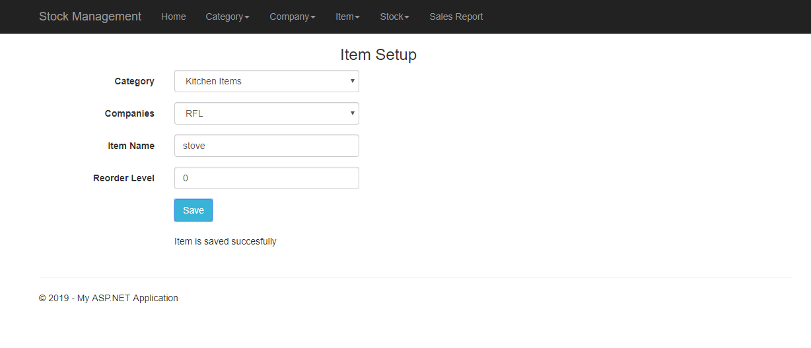
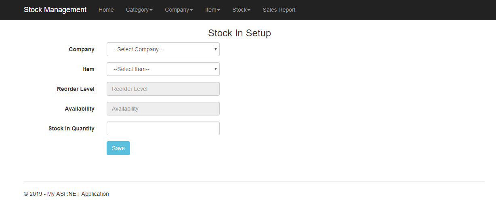
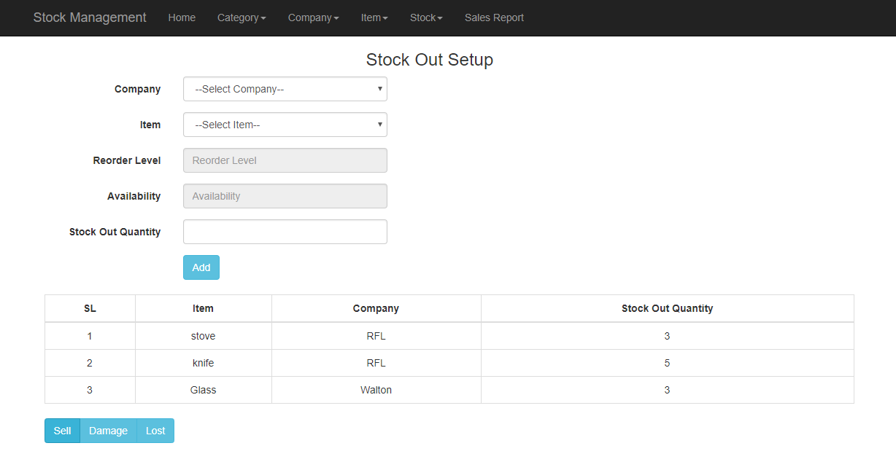
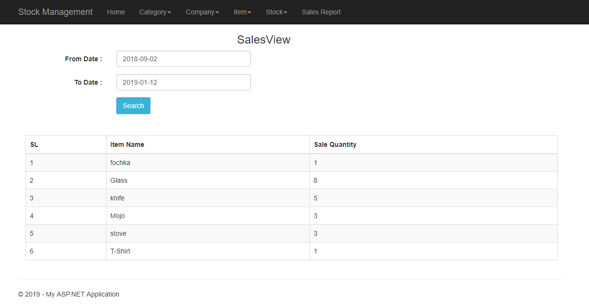

# Stock Management System

**Type :** Web Application \
**Technology Stack :** ASP.NET MVC , C#, jQuery, jQuery Ajax, jQuery Validation, Bootstrap 3, Bootstrap datepiker , HTML 5, CSS 3

## **Description of Project** :

Small shops sometimes face difficulties to manage their stock (In, Out and available items). So, I provide them a web application which has the following features :

| SL | Story Name |
|:------|:-----|
| 1| Category Setup|
|2 | Company Setup|
| 3| Item Setup|
| 4| Stock In|
| 5| Stock Out|
| 6| Search & View Items Summary|
| 7| View Sales Between Two Dates|

## **Some snapshot of project** :

